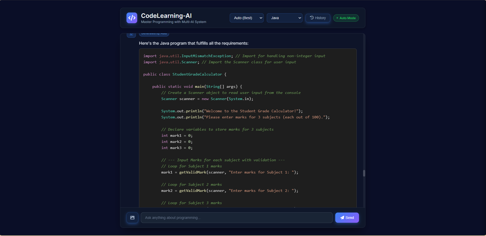
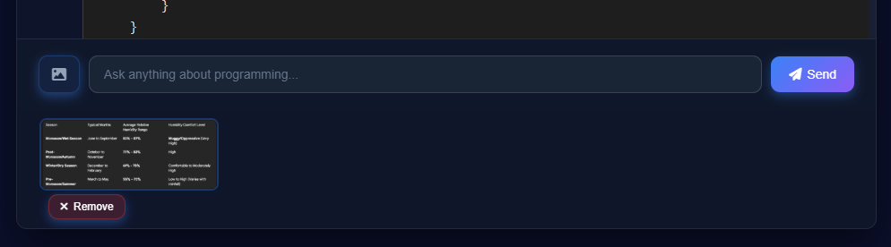
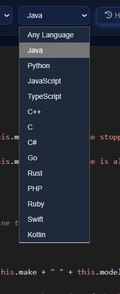

# 🚀 CodeLearning-AI

<div align="center">


**Master Programming with Advanced Multi-AI System**

[Problem](#-the-problem) • [Solution](#-our-solution) • [Screenshots](#-screenshots) • [Architecture](#-architecture) • [Features](#-features) • [Installation](#-installation)

</div>

---

## 📸 Screenshots

### Welcome Screen

*Beautiful animated landing page with feature showcase and call-to-action*

### Chat Interface

*Professional chat interface with AI model selection and language support*

### Code Generation

*Real-time code generation with syntax highlighting and markdown rendering*

### AI Model Selection

*Choose from 7 different AI models or use automatic selection*

### Language Selection

*Support for 13+ programming languages in one platform*

### Chat History

*Persistent chat history with search and management features*

---

## 🎯 The Problem

### Challenges in Learning Programming

**1. Limited Access to Quality Tutors**
- Personal coding mentors are expensive and not accessible to everyone
- Online courses lack real-time, personalized assistance
- Students struggle with debugging and understanding complex concepts

**2. Single AI Model Limitations**
- Dependency on one AI service creates single point of failure
- Different AI models excel at different tasks
- Rate limits and API downtime disrupt learning
- Cost barriers prevent experimentation

**3. Language Barriers**
- Most AI coding assistants focus on 1-2 languages
- Switching between languages requires different tools
- Inconsistent code quality across languages

**4. Lack of Visual Code Analysis**
- Students can't easily share code screenshots for help
- Manual typing of code from images is time-consuming
- Error messages in screenshots are hard to debug

---

## 💡 Our Solution

**CodeLearning-AI** is a multi-AI powered programming tutor that solves these challenges through:

### 🔄 **Intelligent Multi-AI System**
```
User Request → Auto-Select Best AI → Fallback on Failure → Always Available
```
- **7 AI Models** working together (Gemini, GPT-4, DeepSeek, Groq, Cohere, HuggingFace, Perplexity)
- **Smart Fallback Mechanism** - If one fails, automatically tries the next
- **Zero Downtime** - Always have a working AI model
- **100% FREE** - Built entirely on free-tier APIs

### 🌍 **Universal Language Support**
- **13+ Programming Languages** in one platform
- Consistent quality across all languages
- Language-specific optimizations
- Easy switching between languages

### 🖼️ **Visual Code Analysis**
- Upload code screenshots for instant analysis
- AI reads and explains code from images
- Debug errors directly from screenshots
- Powered by Google Gemini Vision

### 🎨 **Professional Learning Experience**
- Beautiful, modern UI with animations
- Real-time code generation with syntax highlighting
- Chat history for reviewing past conversations
- No sign-up or credit card required

---

## 🏗️ Architecture

### System Overview

```
┌─────────────────────────────────────────────────────────────┐
│                     USER INTERFACE                          │
│  ┌──────────────┐  ┌──────────────┐  ┌─────────────────┐  │
│  │   Welcome    │  │     Chat     │  │    History      │  │
│  │   Screen     │  │  Interface   │  │     Panel       │  │
│  └──────────────┘  └──────────────┘  └─────────────────┘  │
└───────────────────────────┬─────────────────────────────────┘
                            │ HTTP/HTTPS
                            ▼
┌─────────────────────────────────────────────────────────────┐
│                   FLASK APPLICATION                          │
│  ┌────────────────────────────────────────────────────────┐ │
│  │              Route Handlers                            │ │
│  │  • /chat  - Process user messages                     │ │
│  │  • /status - Check AI availability                    │ │
│  │  • /      - Serve frontend                            │ │
│  └──────────────────────┬─────────────────────────────────┘ │
│                         │                                    │
│  ┌──────────────────────▼─────────────────────────────────┐ │
│  │          MultiAIAssistant (Core Logic)                 │ │
│  │                                                        │ │
│  │  ┌──────────────────────────────────────────────┐    │ │
│  │  │  AI Selection Strategy                       │    │ │
│  │  │  1. Check user preference (manual/auto)      │    │ │
│  │  │  2. Try primary AI model                     │    │ │
│  │  │  3. On failure → Try next available AI       │    │ │
│  │  │  4. Return response or error                 │    │ │
│  │  └──────────────────────────────────────────────┘    │ │
│  │                                                        │ │
│  │  Features:                                             │ │
│  │  ✓ Language context management                        │ │
│  │  ✓ Image processing (base64)                          │ │
│  │  ✓ Error handling & timeouts                          │ │
│  │  ✓ Prompt optimization per AI                         │ │
│  └────────────────────────────────────────────────────────┘ │
└───────────────────────────┬─────────────────────────────────┘
                            │
        ┌───────────────────┼───────────────────┐
        │                   │                   │
        ▼                   ▼                   ▼
┌──────────────┐    ┌──────────────┐    ┌──────────────┐
│   Gemini     │    │   OpenAI     │    │  DeepSeek    │
│   API        │    │   GPT-4      │    │   API        │
│ (Image+Text) │    │   API        │    │              │
└──────────────┘    └──────────────┘    └──────────────┘
        │                   │                   │
        ▼                   ▼                   ▼
┌──────────────┐    ┌──────────────┐    ┌──────────────┐
│    Groq      │    │   Cohere     │    │ HuggingFace  │
│  (Fastest)   │    │   API        │    │   API        │
└──────────────┘    └──────────────┘    └──────────────┘
        │
        ▼
┌──────────────┐
│ Perplexity   │
│   API        │
└──────────────┘
```

### Data Flow Diagram

```
┌─────────────┐
│    User     │
│   Input     │
└──────┬──────┘
       │
       ▼
┌─────────────────────────┐
│  Frontend Validation    │
│  • Check input          │
│  • Prepare payload      │
│  • Add language context │
└──────────┬──────────────┘
           │
           ▼
┌─────────────────────────┐
│   POST /chat            │
│   {                     │
│     message: string,    │
│     language: string,   │
│     ai_model: string,   │
│     image?: base64      │
│   }                     │
└──────────┬──────────────┘
           │
           ▼
┌─────────────────────────┐
│  MultiAIAssistant       │
│  Decision Tree:         │
│                         │
│  Manual Mode?           │
│  ├─ Yes → Use selected  │
│  └─ No → Auto select    │
│                         │
│  Try AI Model           │
│  ├─ Success → Return    │
│  └─ Fail → Try next     │
└──────────┬──────────────┘
           │
           ▼
┌─────────────────────────┐
│   AI API Call           │
│   • Build prompt        │
│   • Add context         │
│   • Set timeout (30s)   │
│   • Handle response     │
└──────────┬──────────────┘
           │
           ▼
┌─────────────────────────┐
│   Response Processing   │
│   • Parse JSON          │
│   • Extract text        │
│   • Format markdown     │
│   • Error handling      │
└──────────┬──────────────┘
           │
           ▼
┌─────────────────────────┐
│   Frontend Display      │
│   • Markdown render     │
│   • Syntax highlight    │
│   • Save to history     │
│   • Scroll to view      │
└─────────────────────────┘
```

### AI Fallback Strategy

```
User Request
     │
     ▼
┌─────────────────┐
│  Try Gemini     │ ──── Success ───→ Return Response
└────────┬────────┘
         │ Fail
         ▼
┌─────────────────┐
│  Try Groq       │ ──── Success ───→ Return Response
└────────┬────────┘
         │ Fail
         ▼
┌─────────────────┐
│  Try Cohere     │ ──── Success ───→ Return Response
└────────┬────────┘
         │ Fail
         ▼
┌─────────────────┐
│ Try HuggingFace │ ──── Success ───→ Return Response
└────────┬────────┘
         │ Fail
         ▼
┌─────────────────┐
│ Try DeepSeek    │ ──── Success ───→ Return Response
└────────┬────────┘
         │ Fail
         ▼
┌─────────────────┐
│  Try OpenAI     │ ──── Success ───→ Return Response
└────────┬────────┘
         │ Fail
         ▼
┌─────────────────┐
│ Try Perplexity  │ ──── Success ───→ Return Response
└────────┬────────┘
         │ All Failed
         ▼
┌─────────────────┐
│  Return Error   │
│  "No AI Model   │
│   Available"    │
└─────────────────┘
```

---

## ✨ Features

### 🤖 **7 Powerful AI Models**
- **Google Gemini** - Best overall with image analysis support
- **OpenAI GPT-4** - Industry-leading language model
- **DeepSeek** - Powerful and affordable
- **Groq** - Lightning-fast inference
- **Cohere** - High rate limits
- **HuggingFace** - Open-source models
- **Perplexity** - Search-enhanced AI

### 💻 **13+ Programming Languages**
Java • Python • JavaScript • TypeScript • C++ • C • C# • Go • Rust • PHP • Ruby • Swift • Kotlin

### 🎯 **Key Capabilities**
- ✅ **100% FREE** - No credit card required
- 🖼️ **Image Analysis** - Upload code screenshots
- 🔄 **Auto-Fallback** - Seamlessly switches between AI models
- 💬 **Real-time Chat** - Interactive coding assistance
- 📝 **Syntax Highlighting** - Beautiful code display
- 📚 **Chat History** - Save and revisit conversations
- 🎨 **Modern UI** - Professional and responsive design

---

## 🛠️ Installation

### Prerequisites

**Required:**
- Python 3.8 or higher
- pip (Python package manager)
- Git

**Optional (for at least one AI model):**
- API key from any of the 7 supported AI services

### Step-by-Step Setup

#### 1️⃣ Clone the Repository

```bash
# Clone the project
git clone https://github.com/Maruf-Raduan/CodeLearning-AI.git

# Navigate to project directory
cd CodeLearning-AI
```

#### 2️⃣ Install Dependencies

```bash
# Install all required Python packages
pip install -r requirements.txt
```

**Dependencies installed:**
- `Flask` - Web framework
- `google-generativeai` - Gemini API
- `Pillow` - Image processing
- `python-dotenv` - Environment management
- `requests` - HTTP client

#### 3️⃣ Set Up Environment Variables

```bash
# Copy the example environment file
cp .env.example .env

# For Windows:
copy .env.example .env
```

**Edit `.env` file and add your API keys:**

```env
# Add at least ONE API key (recommended: Gemini)
GEMINI_API_KEY=your_gemini_key_here
GROQ_API_KEY=your_groq_key_here
COHERE_API_KEY=your_cohere_key_here
HUGGINGFACE_API_KEY=your_huggingface_key_here
DEEPSEEK_API_KEY=your_deepseek_key_here
OPENAI_API_KEY=your_openai_key_here
PERPLEXITY_API_KEY=your_perplexity_key_here
```

> **Note:** You only need ONE API key to start. The system will automatically use the available model.

#### 4️⃣ Run the Application

```bash
# Start the Flask server
python app.py
```

**Expected output:**
```
[OK] Gemini AI ready
 * Serving Flask app 'app'
 * Debug mode: on
 * Running on http://0.0.0.0:8080
```

#### 5️⃣ Open in Browser

```
http://localhost:8080
```

You should see the beautiful welcome screen! 🎉

### Troubleshooting

**Problem: Module not found error**
```bash
# Solution: Reinstall dependencies
pip install -r requirements.txt --force-reinstall
```

**Problem: Port 8080 already in use**
```bash
# Solution: Use a different port
PORT=3000 python app.py
```

**Problem: No AI model available**
```bash
# Solution: Check your .env file has at least one valid API key
cat .env  # Linux/Mac
type .env # Windows
```

**Problem: API key invalid**
- Verify the key is correct (no extra spaces)
- Check if the API key is active on the provider's dashboard
- Try a different AI model

---

## 🔑 Get FREE API Keys

### Quick Setup Guide

| AI Model | Best For | Free Tier | Setup Time | Get Key |
|----------|----------|-----------|------------|---------|
| **Gemini** ⭐ | Image Analysis | 60 req/min | 2 min | [Get Key](https://aistudio.google.com/apikey) |
| **Groq** ⚡ | Speed | 30 req/min | 2 min | [Get Key](https://console.groq.com/keys) |
| **Cohere** 📊 | High Limits | 100 req/min | 3 min | [Get Key](https://dashboard.cohere.com/api-keys) |
| **HuggingFace** 🤗 | Open Source | Unlimited* | 2 min | [Get Key](https://huggingface.co/settings/tokens) |
| **DeepSeek** 🧠 | Reasoning | Available | 3 min | [Get Key](https://platform.deepseek.com/api_keys) |
| **OpenAI** 🔥 | Quality | Limited | 5 min | [Get Key](https://platform.openai.com/api-keys) |
| **Perplexity** 🔍 | Search | Available | 3 min | [Get Key](https://www.perplexity.ai/settings/api) |

*Rate limited

### Recommended Setup

**For Beginners:**
```env
GEMINI_API_KEY=your_key_here
```
Start with just Gemini - it's the easiest and most capable.

**For Power Users:**
```env
GEMINI_API_KEY=your_key_here
GROQ_API_KEY=your_key_here
COHERE_API_KEY=your_key_here
```
Add multiple keys for redundancy and speed.

---

## 📖 Usage

### Basic Usage

1. **Select AI Model** - Choose from 7 AI models or use Auto mode
2. **Select Language** - Pick your programming language
3. **Ask Questions** - Type your coding question
4. **Upload Images** - Analyze code screenshots (Gemini only)
5. **Get Answers** - Receive complete code with explanations

### Example Queries

```
"Write a Python function to sort a list"
"Explain how async/await works in JavaScript"
"Create a REST API in Java using Spring Boot"
"Debug this code: [paste your code]"
```

### Image Analysis

1. Click the image icon 📷
2. Upload a code screenshot
3. Ask questions about the code
4. Get instant analysis

---

## 🚀 Deployment

### Deploy to Render

1. Fork this repository
2. Create a new Web Service on [Render](https://render.com)
3. Connect your repository
4. Add environment variables
5. Deploy!

### Deploy to Railway

1. Click "Deploy on Railway"
2. Add environment variables
3. Deploy automatically

### Deploy to Vercel

1. Install Vercel CLI: `npm i -g vercel`
2. Run: `vercel`
3. Add environment variables in dashboard

---

## 🤝 Contributing

Contributions are welcome! Please feel free to submit a Pull Request.

1. Fork the repository
2. Create your feature branch (`git checkout -b feature/AmazingFeature`)
3. Commit your changes (`git commit -m 'Add some AmazingFeature'`)
4. Push to the branch (`git push origin feature/AmazingFeature`)
5. Open a Pull Request

---

## 📝 License

This project is licensed under the MIT License - see the [LICENSE](LICENSE) file for details.

---

## 🙏 Acknowledgments

- Google Gemini for powerful AI capabilities
- OpenAI for GPT models
- All open-source AI providers
- Flask framework
- The amazing developer community

---

## 📧 Contact

**Maruf Raduan**

- GitHub: [@Maruf-Raduan](https://github.com/Maruf-Raduan)
- Project Link: [https://github.com/Maruf-Raduan/CodeLearning-AI](https://github.com/Maruf-Raduan/CodeLearning-AI)

---

<div align="center">

**⭐ Star this repo if you find it helpful!**

Made with ❤️ by Maruf Raduan

</div>
